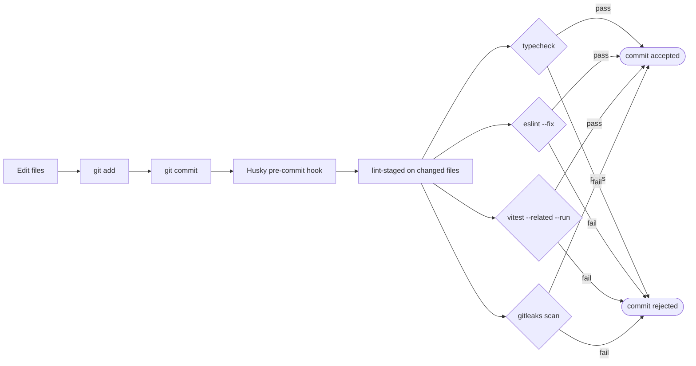
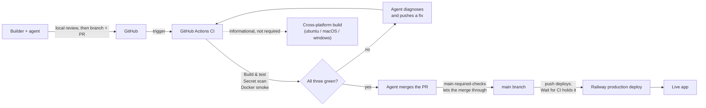
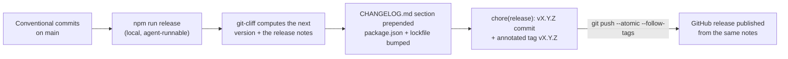

# Vibe Starter — Tooling Design

> Strict TypeScript, zero-warning ESLint, Vitest with TDD, pre-commit gates, GitHub Actions CI, Railway deploy from `main` behind required checks, releases cut locally with `npm run release`. The agent is treated as a first-class user — `AGENTS.md` is the canonical context, the bundled skills pipeline is the recommended orchestration.

This document covers static analysis, testing, CI/CD, repo bootstrap, and agent context. For project-level decisions, see [`PROJECT_DESIGN.md`](./PROJECT_DESIGN.md). For frontend, see [`FRONTEND_DESIGN.md`](./FRONTEND_DESIGN.md). For backend, see [`BACKEND_DESIGN.md`](./BACKEND_DESIGN.md).

---

## Decision summary

| Decision               | Choice                                                                                                                                                                                                                                          | Primary alternative considered                            |
| ---------------------- | ----------------------------------------------------------------------------------------------------------------------------------------------------------------------------------------------------------------------------------------------- | --------------------------------------------------------- |
| TypeScript strictness  | **`strict` + `noUncheckedIndexedAccess`**                                                                                                                                                                                                       | Loose, "maximum strict" with `exactOptionalPropertyTypes` |
| `any` policy           | **Banned as ESLint error**                                                                                                                                                                                                                      | Allowed with warning, allowed silently                    |
| Type-error suppression | **`@ts-expect-error` allowed; `@ts-ignore` forbidden**                                                                                                                                                                                          | Both allowed                                              |
| ESLint preset          | **`@typescript-eslint/recommended-type-checked` + `eslint:recommended`**                                                                                                                                                                        | `eslint:recommended` only                                 |
| Warning policy         | **Zero warnings** (every rule `error` or `off`)                                                                                                                                                                                                 | Warnings allowed                                          |
| Formatter              | **Prettier**, 100-char line limit                                                                                                                                                                                                               | dprint, ESLint stylistic                                  |
| Test runner            | **Vitest**                                                                                                                                                                                                                                      | Jest                                                      |
| Component testing      | **React Testing Library + MSW**                                                                                                                                                                                                                 | Enzyme, Cypress component tests                           |
| Backend testing        | **In-process Hono + test DB**                                                                                                                                                                                                                   | Supertest with mocks                                      |
| TDD methodology        | **Yes — `tdd` skill from the bundled skills pipeline (pre-installed)**                                                                                                                                                                          | Tests written after implementation                        |
| Coverage threshold     | **None**                                                                                                                                                                                                                                        | 80% line coverage                                         |
| Pre-commit             | **Husky + lint-staged + gitleaks**                                                                                                                                                                                                              | Pre-commit hooks omitted                                  |
| Pre-commit tests       | **`vitest --related --run`**                                                                                                                                                                                                                    | Full suite, no tests                                      |
| CI                     | **GitHub Actions**                                                                                                                                                                                                                              | Railway built-in CI, CircleCI                             |
| Deploy                 | **Railway GitHub integration + two `main` rulesets: `main-protection`, `main-required-checks`**                                                                                                                                                 | CI-orchestrated deploy                                    |
| Releases               | **Local and agent-run (`npm run release`, git-cliff)**                                                                                                                                                                                          | A release bot opening a PR in CI                          |
| PR previews            | **Opt-in** (Railway dashboard toggle, off by default)                                                                                                                                                                                           | Enabled by default                                        |
| Agent context          | **`AGENTS.md` canonical + `CLAUDE.md` symlink**                                                                                                                                                                                                 | Tool-specific files maintained separately                 |
| Skill orchestration    | **Bundled skills pipeline pre-installed** ([`semi-sentient/skills-workflow`](https://github.com/semi-sentient/skills-workflow)) — workflow: `grill-with-docs` → `write-a-prd` → `prd-to-plan` → `run-plan` (`tdd` + `commit` run automatically) | None / leave to user                                      |
| Distribution           | **GitHub template repo**                                                                                                                                                                                                                        | npm scaffold CLI                                          |
| Node version           | **24.x**, pinned via `.nvmrc` and `engines`                                                                                                                                                                                                     | LTS without pinning                                       |
| Package manager        | **npm**                                                                                                                                                                                                                                         | pnpm, yarn                                                |
| License                | **MIT**                                                                                                                                                                                                                                         | Proprietary                                               |

---

## TypeScript strictness

### Decision

```jsonc
// tsconfig.json (key compiler options)
{
	"compilerOptions": {
		"strict": true,
		"noUncheckedIndexedAccess": true,
		"noFallthroughCasesInSwitch": true,
		// The following are deliberately NOT enabled:
		// - "exactOptionalPropertyTypes": adds friction for marginal benefit
		// - "noImplicitOverride": ceremony without significant payoff
	},
}
```

Plus an ESLint rule banning `any`:

```jsonc
// eslintrc, key rules
{
	"rules": {
		"@typescript-eslint/no-explicit-any": "error",
		"@typescript-eslint/ban-ts-comment": [
			"error",
			{
				"ts-ignore": true, // forbidden
				"ts-expect-error": false, // allowed
			},
		],
	},
}
```

### Why

**`strict: true`** is the modern default and catches the most common bug class (null/undefined access). The agent handles it fluently. There's no reason to disable.

**`noUncheckedIndexedAccess`** is the highest-ROI addition. It makes `array[i]` return `T | undefined` instead of `T`, matching the runtime truth. A vibe coder writing `users[0].name` without checking gets a compile error instead of a 2am production crash. The agent handles this by adding type guards or non-null assertions when contextually safe.

**Banning `any`** is the slop-prevention lever. The agent's escape valve when types get hard is to cast to `any`. If `any` is a hard error, the agent must actually solve the type problem — which usually means writing better code (proper type guards, narrowing with `unknown`, defining the right interface). This is the single setting that most reduces "AI slop."

**`@ts-expect-error` over `@ts-ignore`.** Both suppress type errors. The first requires a suppressed error to _actually exist_ — so when the underlying code is fixed, `@ts-expect-error` self-clears (it becomes an error itself if there's nothing to expect). `@ts-ignore` silences indefinitely; suppressed errors accumulate and rot.

### Alternatives considered

**Loose / `strict: false`.** Lets the agent move fast at the cost of letting bugs through. Rejected on the philosophy that static analysis carries the load humans can't.

**Maximum strict** (adding `exactOptionalPropertyTypes`, `noImplicitOverride`, etc.). The marginal bug-prevention is real but small; the friction is significant. Agents loop more often on these and sometimes give up. Rejected as a poor trade for prototype-grade work.

### Trade-offs

The agent occasionally gets stuck on a typing problem and burns iterations. Mitigation: AGENTS.md gives explicit guidance — "use type guards, prefer `unknown` over `any`, narrow before access." With this context, the agent's success rate stays high.

---

## ESLint, Prettier, formatting

### Decision

**ESLint** with `@typescript-eslint/recommended-type-checked` + `eslint:recommended`. **Prettier** for formatting. Zero warnings — every rule is `error` or `off`.

### Why

**Type-checked rules** (the `recommended-type-checked` variant) require type information and catch a class of bugs the simpler `recommended` variant misses:

- `no-floating-promises` — forgotten `await`s
- `no-misused-promises` — a `Promise` used as a boolean
- `no-unnecessary-condition` — checking a value that's typed as always truthy
- `no-unsafe-assignment` / `-call` / `-member-access` — trying to use `any` where a real type was expected

These rules genuinely prevent slop. The lint runs slower (~5-15 seconds vs. ~1 second for non-type-checked), but for prototype-scale repos this is fine.

**Zero warnings.** Warnings get ignored, accumulate, and become noise. Three months in, a 400-warning project has trained everyone (including the agent) to ignore them. Forcing every rule to be `error` or `off` keeps lint output meaningful — green means green.

**Prettier separately for formatting.** The standard split: ESLint stops at code style; Prettier handles whitespace, quotes, semicolons, line breaks. `eslint-config-prettier` disables ESLint's stylistic rules to avoid conflicts. 100-char line limit (slight bump over Prettier's default 80, fewer awkward JSX wraps).

### Specific rules toggled on top of presets

| Rule                                         | Setting                                            | Why                                                                                                      |
| -------------------------------------------- | -------------------------------------------------- | -------------------------------------------------------------------------------------------------------- |
| `import/order`                               | `error`, alphabetized within groups                | Sorted imports help the agent and keep diffs clean                                                       |
| `react-hooks/exhaustive-deps`                | `error` (not warn)                                 | Catches real bugs in effect dependencies                                                                 |
| `react/jsx-key`                              | `error`                                            | Missing keys cause real React reconciliation bugs                                                        |
| `no-console`                                 | `error`, except `console.warn` and `console.error` | Forces intentional logging via the logger                                                                |
| `@typescript-eslint/consistent-type-imports` | `error`                                            | Separates type-only imports for tree-shaking and clarity                                                 |
| `tailwindcss/no-arbitrary-value`             | `error`                                            | Discourages `bg-[#f00]` / `text-[13px]` so the design system stays consistent (see `FRONTEND_DESIGN.md`) |

### Alternatives considered

**`eslint:recommended` only.** Simpler, faster lint. Rejected because it misses the type-aware rules that prevent the highest-impact bugs.

**Biome / dprint.** Rust-based alternatives that combine lint + format. Faster, but smaller rule set, smaller community, less mature TypeScript support. Revisit in 12 months.

**ESLint flat config** (`eslint.config.js`). Adopted — it's the modern standard. Old `.eslintrc.json` is legacy.

---

## Testing

### Decision

**Vitest** as the runner. **React Testing Library + MSW** for component tests. **In-process Hono + test database** for backend tests. **TDD via the `tdd` skill** (pre-installed from the bundled skills pipeline). **No coverage threshold.** Tests **colocated** with source.

### Why this shape

The default "Vitest + RTL + 80% coverage" advice produces test slop in vibe-coded contexts. We deliberately reject coverage thresholds, E2E tests, and most UI tests to prevent the failure modes:

1. **Tests written for coverage** become tautological — `expect(getUser(1)).toEqual(getUser(1))`. Coverage gates produce these.
2. **UI tests for prototype-grade UIs** are expensive to maintain and rarely catch real bugs (the bugs they catch are visible on the screen anyway).
3. **E2E tests** are too much rope — flaky, slow, and require non-engineers to debug Playwright.

The bugs that actually ship in vibe-coded apps:

| Bug class                                                                   | Severity    | How we catch it                                     |
| --------------------------------------------------------------------------- | ----------- | --------------------------------------------------- |
| Access-control bugs (a user reaching another user's data or an admin route) | High        | Backend integration tests against the auth scaffold |
| Data integrity (lost updates, broken migrations)                            | Medium-high | Backend integration tests; Drizzle migration tests  |
| Type-correct-but-semantically-wrong logic                                   | Medium      | Targeted unit tests via TDD                         |
| UI rendering crashes                                                        | Lower       | Error boundary catches; tests skipped               |

TDD inverts the test-slop dynamic. Tests written _before_ implementation drive the design — they describe the behavior the developer wants. When you can't write the test, the design is wrong; refactor instead of skipping the test. The `tdd` skill (pre-installed from the bundled skills pipeline) codifies the red-green-refactor methodology, is referenced by AGENTS.md for ad-hoc work, and is read automatically by `write-a-prd` and `run-plan` when the full pipeline is used.

### Concrete patterns

**Backend integration tests** use the `createTestServer()` helper that wraps Hono's `app.request()` — no HTTP, no mocking:

```typescript
import { createTestServer } from './helpers';
import { resetDb } from './helpers';

describe('GET /api/orders', () => {
	beforeEach(resetDb);

	it('returns only the orders owned by the requesting customer', async () => {
		const customerA = await createUser({ email: 'a@example.com', role: 'user' });
		const customerB = await createUser({ email: 'b@example.com', role: 'user' });
		await createOrder({ userId: customerA.id, description: 'Intro session' });
		await createOrder({ userId: customerB.id, description: 'Follow-up session' });

		const server = createTestServer();
		const res = await server.request('/api/orders', {
			headers: { Cookie: await loginAs({ userId: customerA.id, role: 'user' }) },
		});

		expect(res.status).toBe(200);
		const body = await res.json();
		expect(body.orders).toHaveLength(1);
		expect(body.orders[0].description).toBe('Intro session');
	});
});
```

This test exercises the real Hono router, real auth middleware, real Drizzle queries, real Postgres — but in-process and fast (no HTTP overhead). Access-control bugs — a customer seeing another customer's order — are nearly impossible to write without the test catching them. This is the access-control anchor test the "Ready for real users?" checklist refers to (see `PROJECT_DESIGN.md`).

**Component tests** use MSW to mock API responses:

```typescript
import { render, screen } from '@testing-library/react';
import { server } from './msw-server';
import { http, HttpResponse } from 'msw';
import { OrdersList } from '../src/web/components/OrdersList';

it('shows the orders returned by the API', async () => {
  server.use(
    http.get('/api/orders', () => HttpResponse.json({
      orders: [{ id: 1, description: 'Intro session', status: 'paid' }],
    }))
  );

  render(<OrdersList />);
  expect(await screen.findByText('Intro session')).toBeInTheDocument();
});
```

MSW intercepts at the network layer; the same handlers can power offline development if needed.

### Conventions in `AGENTS.md`

- Write tests for: (a) any new access-control rule, (b) any business logic that doesn't reduce to type-checking, (c) any bug you've fixed (regression test).
- Do NOT write tests for: (a) UI rendering, (b) trivial getters/setters, (c) anything to satisfy a coverage threshold.
- Co-locate route/component tests with their source by default (`Button.tsx` + `Button.test.tsx`), but keep a `src/server/__tests__/` tree for cross-cutting invariants (access-control, full auth flow).
- For any new feature, read `tdd` skill and follow red-green-refactor.

### Alternatives considered

**Jest.** Industry standard. Rejected because Vitest is faster (native ESM, no Babel), uses Vite's resolver (so test imports match dev/prod imports), and has identical API. No reason to keep Jest.

**Cypress component tests.** Rejected — heavyweight for what they buy.

**Playwright E2E.** Documented out of scope (see `PROJECT_DESIGN.md`).

**80% coverage threshold.** Rejected as a slop-producer. TDD produces meaningful coverage as a byproduct.

---

## Pre-commit hooks

### Decision

**Husky + lint-staged + gitleaks** for pre-commit. Runs typecheck, lint, related-tests, and secret-scanning on staged files.

### Why

CI catches what slips through local checks, but a CI-only feedback loop is slow — the agent commits broken code, the human pushes, CI fails, friction. Pre-commit gates surface failures at commit time.



**`vitest --related --run`** runs only tests in the dependency graph of the staged files. Fast (seconds, not minutes), agent-friendly. Won't punish the developer for unrelated flakes.

**gitleaks** scans staged content for committed secrets — API keys, tokens, password-like strings. Catches the worst-case "I committed my `STRIPE_SECRET_KEY`" failure before it leaves the machine.

### Asymmetry: pre-commit vs CI

Pre-commit must be fast enough that the agent doesn't get stuck waiting. CI is the safety net.

| Check     | Pre-commit        | CI               |
| --------- | ----------------- | ---------------- |
| Typecheck | Staged-file scope | Full project     |
| Lint      | Staged-file scope | Full project     |
| Tests     | `--related`       | Full suite       |
| gitleaks  | Staged content    | Full git history |
| Build     | —                 | Yes              |

### Alternatives considered

**No pre-commit hooks.** Standard for teams that trust CI. Rejected for the vibe-coder context — the friction of "discover failure on CI 2 minutes after commit" is meaningfully worse than "discover failure at commit time."

**Full test suite on pre-commit.** Slower; gets unbearable as the project grows. The `--related` heuristic is the right balance.

---

## CI/CD

### Decision

**GitHub Actions** for CI. **Single workflow** on PR + push to `main`, four jobs. **Railway's GitHub integration** for deploy, gated by **two repository rulesets** on the default branch: `main-protection` (no force-push, no deletion, bypassable by nobody) and `main-required-checks` (three of those jobs green, bypassable by the admin repository role and no one else). Nothing else is required: no review, no "require a pull request", no up-to-date branch. **No release automation in CI, anywhere.** **PR previews** are opt-in.

### Why



**GitHub Actions** is the obvious choice — same auth as the repo, free at our scale, near-universal training data. It works with whatever repo collaborators the project has, with no special org setup required.

**Single workflow** because prototype-scale repos don't have enough surface area to justify split workflows. One file, four jobs: `Build & test` (typecheck + lint + the DB-backed suite + build, against a Postgres service container), `Secret scan` (gitleaks over full history), `Docker smoke` (builds both production images and boots the real stack — Postgres + api + nginx — asserting through the proxy that the SPA and `/api/health` actually serve), and `Cross-platform build (<os>)` (a 3-OS matrix, informational). The first three are the required checks; the matrix is not, because a matrix leg's check name moves with the matrix.

**Railway's GitHub integration** auto-deploys on push to `main` — every connected service on every push, since neither `railway.*.json` sets a `watchPatterns` filter, which is what keeps the api and the web service on one commit. `main-required-checks` is what stops a pull request merging while any of the three checks is red, and Railway's **Wait for CI** toggle — recommended, and part of the day-one sequence in `DEPLOY.md` — holds the deploy until the checks report. Between them, what reaches production has compiled, passed its tests, and been proven to boot as a container. That is the honest limit of the claim: CI proves the app **builds, boots, and passes its tests**. It cannot see that a page looks wrong, and a bundle that loads and then throws at runtime is out of its reach too. Local review before the PR is what covers that, and it is deliberately step one of the publish loop in `docs/agents/shipping.md` — not an optional nicety. No deploy tokens for the builder to manage. Railway also gives the app a public URL, which Stripe webhooks need in production (in dev, the Stripe CLI forwards events — see `BACKEND_DESIGN.md`).

**Branch protection, applied by a command rather than by hand.** `npm run setup:github` upserts both rulesets (each matched by name, so re-running updates instead of duplicating) and turns on auto-delete-merged-branches. It needs **admin** access on the repository — `MAINTAIN` cannot change these settings — and it refuses to apply anything unless all three job display names are actually present in `ci.yml`, because GitHub will wait forever for a required check that no job produces, which blocks every PR.

**Two rulesets rather than one, because the two halves need different bypass rules.** History destruction is absolute: `main-protection` (`non_fast_forward` + a decorative `deletion` rule — GitHub refuses to delete a default branch before rules are consulted anyway) ships with an empty bypass list, because a revert is revertible and a rewritten history is not. Required status checks cannot be absolute, because `npm run release` pushes a version-bump commit and its tag straight to `main` and that commit has no check runs on it; measured against a live repository, a checks ruleset with no bypass refuses that push pre-receive (`GH013 … 3 of 3 required status checks are expected`) and the ref does not move. So `main-required-checks` lists the **admin repository role** as a bypass actor, in `always` mode — `pull_request` mode was tried and does not admit a direct push.

**The trade-off, recorded because it is a real weakening.** An admin bypass makes the CI gate _advisory for whoever administers the repository_ and binding for everyone else; the ruleset stops being a wall and becomes an accident backstop. That is accepted here on the grounds that the target repo is a solo builder's, that the enforcement which actually matters lives in the agent contract (`docs/agents/shipping.md`: every change but the release push goes through a branch and a green PR), and that the alternative — cutting releases through a PR — buys a round trip and a bot-shaped problem this template deleted on purpose (see [Why not release-please?](#why-not-release-please)). The absolute guarantee is not given up, only relocated: force-push protection bypasses nobody, including the admin.

**The script owns both bypass lists and sends them on every write.** A `PUT` that omits `bypass_actors` preserves whatever GitHub has stored (measured, not documented), so omitting it would let a hand-added bypass survive silently and would make `main-protection`'s empty list a promise the script could not keep. The cost of sending it every time is the honest one to state: a bypass actor added by hand in the UI is overwritten on the next run.

Two further caveats worth keeping: repository rulesets are a **paid feature on private repositories**, so on a private repo on the Free plan both ruleset writes are refused while the merge-settings change still lands — meaning `npm run setup` exiting 0 does **not** prove they were installed (check `gh api /repos/{owner}/{repo}/rulesets`); and the same script also enables GitHub's auto-merge **capability**, which is a human escape hatch in the UI, enabled on no PR by anything in this repo.

**No required reviews** — and this is a choice, not an omission. The target user is a solo builder working with an agent; a required approval is a rule they can only satisfy by approving their own pull request. Self-approval is theatre that trains people to click through gates. The checks are what actually protect `main`. A team that wants reviews adds the rule in the GitHub UI: `setup:github` only ever touches the two rulesets it owns, each by name, so a third ruleset survives its re-runs.

**PR previews** (a Railway feature) give each open pull request its own ephemeral deployment, and are **opt-in** — a dashboard toggle, off unless the builder turns it on. They are genuinely useful for showing work-in-progress to a friend or early user without anyone running it locally, but they are not part of the merge path: a preview is not a review gate, and the loop does not wait on one. They also cost money per open PR and need their own `APP_ORIGIN` and test-mode Stripe wiring to work at all, which is a poor default to hand a non-engineer. `DEPLOY.md` covers turning them on.

### Alternatives considered

**CI-orchestrated deploy** (run Railway CLI from Actions). More control, more complexity, more credentials to manage. Rejected — the GitHub integration is simpler and equally safe given the required-checks ruleset.

**Railway's built-in CI.** Deploy-only, doesn't run tests. Not a substitute for GitHub Actions.

**CircleCI / Travis / Jenkins.** No reason to introduce a third party when Actions handles it.

---

## Repo bootstrap

### Decision

**GitHub template repo** distribution. **4-command Quick Start** (clone, `npm run setup`, `docker compose up`, `npm run dev`). **`npm run setup`** (`npm install && bash scripts/bootstrap.sh`) is the single entry point that installs dependencies and bootstraps the new repo. **`predev` script** auto-runs migrations before dev server starts.

See `PROJECT_DESIGN.md` for the distribution decision rationale (template vs CLI).

### What the bootstrap step does

`npm run setup` runs `npm install` and then `bash scripts/bootstrap.sh`. The bootstrap script is idempotent and safe to re-run; it:

1. **Copies `.env` from `.env.example`** if `.env` is absent.
2. **Resolves a project name** — an explicit argument wins (`npm run setup -- my-app`), then an interactive prompt (`Project name [<dir>]:`, where an empty answer accepts the default), falling back to the repo directory name when running non-interactively.
3. **Resets release state** by calling `node scripts/reset-release-state.mjs "$NAME" "$ORIGIN"` (see [Versioning automation](#versioning-automation)). The node module — not `sed` — owns the rewrite: it renames `package.json` (name + version → `0.0.0`), resets `CHANGELOG.md` to a header + intro stub, and rewrites the `README.md` H1 from `# vibe-starter` to the project name (the H1 only — other `vibe-starter` references, like the upstream CHANGELOG link, intentionally keep pointing at the template). That is the whole list: there is no release automation to reconfigure downstream, because none ships. The CHANGELOG stub must stay byte-identical to `cliff.toml`'s `[changelog] header`, trailing blank line included — `git-cliff --prepend` works by removing that exact string from the file and re-emitting it, so a one-byte drift duplicates the header on the first release (which is also why `CHANGELOG.md` is Prettier-ignored: Prettier collapses trailing newlines, and downstream the stub _is_ the whole file). Each rewrite is guarded, so the module **no-ops** on the upstream `semi-sentient/vibe-starter` origin, the `vibe-starter` name, or an already-renamed package — which is what keeps this template repo itself on its own version line.
4. **Generates a strong `SESSION_SECRET`** in `.env` when the value is empty or still the legacy template placeholder; a real, user-set secret is left untouched, so re-running setup never rotates it (which would invalidate every live session). `.env.example` ships `SESSION_SECRET=` **empty on purpose** — any ≥32-char placeholder would be a usable weak default that signs cookies, so the example is blank and bootstrap fills it (or the boot-time check fails loudly).
5. **Applies the GitHub settings** by calling `node scripts/setup-github.mjs` (see [CI/CD](#cicd)) — the `main-protection` and `main-required-checks` rulesets plus the repository merge settings. Applying a required-checks ruleset this early, possibly before the new repo has a commit CI has ever run on, is not the hazard it first looks like: the script refuses without **admin** access, so a non-admin never installs it at all, and whoever runs bootstrap on their own repo is an admin — which is exactly who the checks bypass covers. This runs in the script's quiet `auto` mode: no `gh`, no GitHub sign-in, a non-GitHub origin, no admin access, or a refusal from GitHub each produce **one calm line and exit 0**, because an optional step must never fail `npm run setup` in front of a non-engineer. `npm run setup:github` is the same code in `explicit` mode, where those states are loud, non-zero, and carry gh's own error text. The bootstrap call is additionally `|| true`, since the script runs under `set -euo pipefail`.

Splitting the rewrite into a node module (rather than inline `sed`) keeps the JSON edits structured and the idempotency guards readable, and lets the bootstrap shell stay a thin orchestrator.

### README structure

The starter ships a README with 7 core sections plus a pre-launch tutorial section:

1. **What this is** — one paragraph
2. **Quick Start** — 4 commands
3. **Stack** — bullet list with one-line description per piece
4. **Project structure** — annotated tree
5. **Development workflow** — pre-commit hooks, TDD, AGENTS.md role
6. **Deploy** — short overview that points to `DEPLOY.md` (the full go-live runbook: external accounts + first deploy)
7. **Skills** — list of the pre-installed skills and the recommended `grill-with-docs` → `write-a-prd` → `prd-to-plan` → `run-plan` workflow
8. _(Pre-launch only)_ **First-feature tutorial** — a contact-form walkthrough (public endpoint → zod validation → `rateLimit()` + honeypot → email via the Resend wrapper); tracked in `TODO.md`

---

## Agent context

### Decision

**`AGENTS.md` is canonical** for agent context. **`CLAUDE.md` is a symlink** for Claude Code. Tool-specific files (`.cursorrules`, `.windsurfrules`, etc.) are not duplicated — `AGENTS.md` is the source of truth.

**The `auth` skill** ships pre-installed (the only skill authored specifically for this starter and shipped upfront). Other skills accumulate reactively as patterns recur.

**The bundled skills pipeline** ([`semi-sentient/skills-workflow`](https://github.com/semi-sentient/skills-workflow)) ships pre-installed. The full pipeline is bundled — `grill-with-docs`, `grill-me`, `write-a-prd`, `prd-to-plan`, `run-plan`, plus the supporting `tdd` and `commit` — so the builder makes zero decisions about which skills to install. The ideal workflow is `grill-with-docs` → `write-a-prd` → `prd-to-plan` → `run-plan`; `tdd` and `commit` are invoked automatically by the orchestrating skills and never directly. New users can shortcut by invoking `write-a-prd` first — it auto-invokes `grill-with-docs` if no grilling session has run.

**One MCP server ships pre-registered:** `context7` (`@upstash/context7-mcp`, in `.mcp.json`), a docs-lookup fallback for installed libraries without dedicated tooling. Usage guidance — including the version-drift caveat — lives in `docs/agents/mcp-usage.md`.

### Why one canonical file

Agent rule files have proliferated: `CLAUDE.md` (Claude Code), `.cursorrules` (Cursor), `.cursor/rules/*.mdc` (newer Cursor), `.roo/rules/*.md` (Roo Code), `.windsurfrules`, `.github/copilot-instructions.md`, and the emerging `AGENTS.md` convention.

Maintaining six near-duplicate files invites drift. `AGENTS.md` is increasingly read by major agents and is the cleanest cross-tool target. A symlink (`CLAUDE.md → AGENTS.md`) handles Claude Code without duplication.

### What goes in `AGENTS.md`

Apply one filter, borrowed from Addy Osmani's [AGENTS.md as a protocol file](https://addyosmani.com/blog/agents-md/): **can the agent discover this by reading the code?** If yes, leave it out. `AGENTS.md` is a protocol file — the minimum essential context the agent genuinely cannot derive from the repo itself. Stack declarations, directory tours, library do/don't lists, and architecture overviews belong in `/docs` (this design doc and its siblings) and `CONTEXT.md` (maintained by `grill-with-docs`), where they are loaded deliberately rather than re-read every turn. Task-scoped conventions sit one layer below that: `AGENTS.md` carries a "Topic Documentation" routing table pointing at the short topic docs under `docs/agents/` — read only when the task matches the row, so the protocol file stays lean.

The starter ships `AGENTS.md` with a handful of short sections, each earning its place against the filter. The five that carry the most weight: `CLAUDE.md` is a symlink to `AGENTS.md` so Claude Code picks up the same content.

**1. Non-Negotiables.** Collaboration rules the agent cannot infer from code: surface assumptions, stop on conflicts, push back when you disagree, prefer the boring solution, touch only what was asked. About _how_ the agent behaves, not _what_ the codebase looks like.

**2. Quality Expectations.** One short paragraph setting tone ("this codebase will outlive you — fight entropy"). Deliberately brief; tone-setting has diminishing returns and the article's caution about "general style guides" applies past a paragraph.

**3. Coding Standards.** Conventions a fresh agent would otherwise guess at: no barrel exports, alphabetical sorting (imports/exports/object keys/destructured props), file-naming case rules, `interface` over `type`, `as const` over `enum`, and a numbered priority order for when guidelines conflict. These anchor patterns from day one of a near-empty repo — once the codebase has examples, the agent could derive most, but the explicit rules keep the first commits from drifting.

**4. Plan Mode.** Where plans live (`.agents/plans/{kebab-name}.md`), when to run `grill-with-docs` first, and the requirement to read the `tdd` skill before adding new behavior. Pure process — invisible in the code.

**5. Temporary Artifacts.** Scratch files go in `.agents/scratch/`, not `/tmp/`. A convention the agent would otherwise default away from; the `.gitignore` entry alone doesn't communicate the intent.

### What deliberately stays out

The article warns hardest against the "context dump" pattern. The starter omits, by design:

- **Stack declaration.** `package.json` is authoritative; `npm ls` is faster than re-reading a list that goes stale. Stack rationale lives in this doc and the sibling design docs.
- **Library do/don't lists.** "Use shadcn's `Table`, not TanStack Table until you need it" / "Tailwind tokens over arbitrary values" / "Drizzle, not raw `pg`" are discoverable from the dependency tree and existing usage. Surfacing them as rules competes with rules that _aren't_ discoverable. Library-specific patterns live in skills (`shadcn-patterns`, `tailwind`, `stripe`, `drizzle-postgres`) — created reactively as failure modes appear, not speculatively upfront.
- **Build-and-verify command list.** `package.json` scripts are the source of truth. The `tdd` and `run-plan` skills already brief the agent on the verify gate; AGENTS.md should not duplicate the commands.
- **Directory tours and architecture overviews.** `/docs/*_DESIGN.md` and `CONTEXT.md` handle this, loaded on demand.
- **Skill catalog as freeform prose.** Claude Code surfaces skill descriptions automatically when triggered. The README documents the recommended `grill-with-docs` → `write-a-prd` → `prd-to-plan` → `run-plan` workflow for humans; AGENTS.md does not need to restate it.

### Slop-attractor guidance

Anti-patterns like "don't add dependencies casually," "don't introduce a new state library," "don't disable ESLint rules," "don't reinvent the auth scaffold" are real, but they fit better in two places than in a top-level do/don't list:

- The general posture ("prefer the boring solution," "touch only what you're asked") is already in **Non-Negotiables**.
- The specific anti-patterns belong in the skill that owns the affected area — access-control warnings in the `auth` skill, styling warnings in a future `tailwind` skill, dependency-hygiene guidance in a project ADR.

This keeps the root file short enough that the agent actually reads it, while pushing detail to layers that load only when relevant.

### Why ship the `auth` skill upfront, but no other skills?

Most prototype-specific skills (`shadcn-patterns`, `tailwind`, `stripe`, `drizzle-postgres`, `hono-api`) earn their place only after we've seen the failure mode they prevent. Writing them upfront is speculative work.

The exception — and the only skill shipped upfront — is the `auth` skill, because:

1. The starter ships auth and access control as primitives. The agent needs the contract on day one.
2. The cost of getting access control wrong is the highest of any skill on the list (a user reading or mutating another user's data, or a `user` reaching an `admin`-only route).
3. We can write it once, drawing directly from how the starter implements auth — it's documenting code that exists, not synthesizing patterns.

The `auth` skill documents: how to add a protected route (`requireRole`), the role model (`admin`/`user`), the ownership rule (every query for user-owned rows filters by `userId = c.var.user.id` unless the caller is `admin`), and the optional multi-tenant escape hatch (add a `tenantId` FK and scope by it only if you ever build a true multi-tenant SaaS — see `BACKEND_DESIGN.md`). Other skills are added as the same correction recurs across multiple prototypes.

### Bundled skills pipeline integration

The starter ships with the full pipeline pre-installed. The builder doesn't pick skills — the point of the starter is to remove that decision so a vibe coder can produce good code without curating their own agent toolbox.

Pre-installed skills:

| Skill             | Role                                                                                                                                                                                                                               |
| ----------------- | ---------------------------------------------------------------------------------------------------------------------------------------------------------------------------------------------------------------------------------- |
| `grill-with-docs` | Stress-tests an idea against the existing domain model, sharpening terminology and updating `CONTEXT.md` / ADRs inline. Entry point for non-trivial features.                                                                      |
| `grill-me`        | Adversarial grilling of a plan/design without the doc-update step; the lighter sibling of `grill-with-docs`.                                                                                                                       |
| `write-a-prd`     | Captures the resolved design as a PRD. Auto-invokes `grill-with-docs` if no grilling session has run, so it's also a valid entry point for users who want a simpler flow.                                                          |
| `prd-to-plan`     | Breaks the PRD into tracer-bullet phases with confidence-scored acceptance criteria.                                                                                                                                               |
| `run-plan`        | Executes the plan in a fresh conversation by delegating phases to specialized sub-agents.                                                                                                                                          |
| `tdd`             | Red-green-refactor methodology. Never invoked directly — read by `write-a-prd` while authoring; every Code sub-agent spawned by `run-plan` is briefed to apply it; referenced by `AGENTS.md` for ad-hoc work outside the pipeline. |
| `commit`          | Produces a Conventional Commits message from staged changes. Invoked automatically by `run-plan` after each phase; those messages are exactly what `npm run release` reads to build `CHANGELOG.md`.                                |

The ideal workflow is `grill-with-docs` → `write-a-prd` → `prd-to-plan` → `run-plan`, with steps 1–3 in one conversation and step 4 in a fresh one. See [`semi-sentient/skills-workflow` docs/WORKFLOW.md](https://github.com/semi-sentient/skills-workflow/blob/main/docs/WORKFLOW.md) for the full walkthrough.

The bundled set is pinned in `skills-lock.json` and managed with the `skills` CLI: `npx skills experimental_install` restores the locked set into a fresh clone, and `npx skills update` moves them to the latest upstream versions when a new version of the pipeline lands. The starter's `CHANGELOG.md` notes when bundled skill versions move.

---

## Mundane decisions resolved

A few items resolved without dedicated sections:

- **Node 24** pinned via `.nvmrc` and `engines` field in `package.json`. CI uses the same version. Pinning matters because vibe coders' machines have inconsistent Node installs.
- **npm** as package manager (not pnpm or yarn). Most widely used; least friction for non-engineers; `package-lock.json` committed.
- **License: MIT.** A `LICENSE` file ships in the repo. The starter is published as a public repo, and MIT is the boring, permissive default that lets anyone clone and build on it.
- **Repo name: `vibe-starter`.** Matches the package name; the bootstrap script swaps it for the builder's chosen name.
- **Storybook: not shipped.** Overkill for prototype scale.

---

## Versioning automation

**`npm run release`** — a single local command, runnable by the agent, that cuts the whole release. Nothing runs in CI and no bot opens a pull request. `git-cliff` (configured by `cliff.toml`) reads the conventional commits since the last `vX.Y.Z` tag and works out the next version; `scripts/release.mjs` turns that into an ordered command plan and runs it under the invoker's own `git`/`gh` credentials.



The generated CHANGELOG follows [Keep a Changelog](https://keepachangelog.com/) format — `## [X.Y.Z] - YYYY-MM-DD` headings over `Added`, `Changed`, `Deprecated`, `Removed`, `Fixed`, `Security` sections, mapped in `cliff.toml` from `feat`, `perf`, `deprecate`, `revert`, `fix` and `security` respectively. Every other conventional type (`chore`, `docs`, `build`, `ci`, …) is dropped by a trailing catch-all parser, so those never reach the changelog.

Two consequences of that mapping worth stating plainly, because both look like bugs the first time:

- **A window of nothing but `chore`/`docs`/Dependabot commits produces no release.** The command refuses and says so, naming the six types that would have counted. That is the intended policy — a version bump whose changelog would be empty tells a downstream reader nothing. Landing one commit of a listed type is the escape hatch.
- **The notes are captured before anything is written.** The plan's first command is a read-only `git-cliff --strip all`; if it comes back with no content the run stops there, having changed no file, created no tag and pushed nothing. Every mutation is downstream of that check.

`scripts/release.mjs` is a pure `planRelease()` decision core plus a thin CLI, mirroring the shape of the other `scripts/` modules — so the exact argv of every command in a release is asserted in tests without spawning anything. It refuses, rather than guessing, on: a dirty working tree, being on a branch other than the default one, nothing releasable in the window, version tags that exist but do not match `vX.Y.Z`, and a computed version that is not three plain numbers.

**The release push goes straight to `main`, and the rulesets are shaped around that.** It was run against them: the release commit has no check runs on it, so a `main-required-checks` ruleset with no bypass refuses the push pre-receive and the branch never moves. The chosen remedy is the admin bypass on that ruleset — the reasoning, and what it costs, is in [CI/CD](#cicd) above; the operator-facing version, with the recovery recipe for a refused push, is in [`DEPLOY.md`](../../DEPLOY.md#branch-protection). Two details of the push itself belong here rather than there. First, the tag: `--follow-tags` alone is **not** atomic and a `target: branch` ruleset never matches `refs/tags/*`, so a refused branch update still publishes the `vX.Y.Z` tag — orphaning it on a commit no branch contains, which the next release then measures from and finds nothing to release. `git push --atomic --follow-tags` makes the pair one transaction (`atomic transaction failed`, neither ref moves), and that is why the flag is in the plan. Second, the release push is the **only** direct push to `main` this template sanctions; everything else, reverts included, goes through a branch and a green PR, which is enforced by the agent contract rather than by GitHub.

### Why not release-please?

The template's first version of this used [`release-please`](https://github.com/googleapis/release-please): a GitHub Action watching `main` that opened a release PR, which a maintainer merged to cut the tag. Every one of those four release PRs was merged by hand — auto-merge was never enabled on any of them — and that is the only reason the tags got cut at all. It was **removed rather than repaired**, because the one failure mode this repository did observe makes it unable to run unattended under required checks, and the obvious repair for that failure mode is closed off by documented GitHub behaviour:

1. **Observed here: workflow runs on bot-authored PRs park in `action_required`.** GitHub holds them until a human clicks "Approve and run". Release PR #14's only check run was created at 14:07 and did not start until 20:14 — six hours parked; #8, #10 and #12 recorded no check runs, ever. Under a required-checks ruleset such a PR can never merge: the check it is blocked on never starts.
2. **The repair that mode 1 points to — enable auto-merge and let the PR land itself — cannot work, because a push made with the default `GITHUB_TOKEN` does not re-trigger workflows.** GitHub suppresses those triggers deliberately, to prevent recursive runs. This was never hit in practice here: the human merges carried a human actor, so the release workflow did fire on each merge commit and each one was tagged. Auto-merged as designed, the same merges would have produced no follow-up run and no tag — unattended releases would have silently stopped happening.

Both the parking and the suppression are fixable only by minting a PAT or a GitHub App token and storing it as a secret in every repo generated from the template — more setup friction than the release PR was ever worth, in a starter whose whole premise is that a non-engineer never has to touch repo settings. Deleting the machinery makes both cease to exist instead of being worked around: there is no bot PR left to park, and no `GITHUB_TOKEN` push left to suppress.

**Why releases run locally.** `npm run release` executes as whoever invoked it: their push permission, their `gh` token. There is no bot identity, so nothing parks; there is no `GITHUB_TOKEN` push, so nothing is suppressed; and there is no per-repo secret for a downstream builder to provision. The cost is that a release becomes a deliberate act someone (or their agent) performs — which is the right shape here, since most repos generated from the template will never cut one, and the ones that do want to choose when.

**Why merge commits stay.** No squash-only setting is applied anywhere, by `setup:github` or otherwise. Squash-merging rewrites a branch's individual commit messages into one subject taken from the PR title — and the changelog is built from those individual messages. The `run-plan` skill in particular writes non-conventional PR titles by design, so squashing would feed git-cliff a title that maps to nothing while discarding the `feat:`/`fix:` commits underneath it.

### Downstream reset

A repo generated from this template starts its own version line at `0.1.0`, independent of whatever version the template itself is on. `npm run setup` (via `scripts/reset-release-state.mjs`, see [What the bootstrap step does](#what-the-bootstrap-step-does)) makes this happen by setting `package.json`'s version to `0.0.0` and truncating `CHANGELOG.md` to its intro stub. **The expected first downstream release is `0.1.0`.** The upstream template repo is unaffected — its own origin/name/package guards make the reset a no-op there, so it keeps advancing on its existing version line.

Why `0.1.0`: the seeding is a rule in `scripts/release.mjs`, not a config key anything can silently ignore. Before computing a bump the CLI asks `git tag -l 'v[0-9]*'` whether this repo has ever released; when nothing matches it skips git-cliff's bump entirely and releases `0.1.0`. That is what stops a fresh downstream repo from inheriting the template's version line out of the commit history it was copied with. Note the glob is deliberately **looser** than `cliff.toml`'s anchored `tag_pattern` (`^v[0-9]+\.[0-9]+\.[0-9]+$`): `v1.2`, `v1.3.0-rc.1` and `v2024.01` match the glob and not the pattern, and answering "never released" for those would regress a real project's version to `0.1.0`. They land instead as a refusal that says which tag shape to add.

There is no fallback footer to remember, because there is no release PR to correct. The run prints the version it settled on before the first command executes (`Releasing v0.1.0 (from 0.0.0)`), but it is **not** interactive and does not pause for a confirmation — what actually guards the first downstream release is the refusal set above, which turns every ambiguous tag state into a stop with an explanation rather than a guess. A version that did get pushed wrongly is fixed the ordinary way: correct the tags and release again.

---

## Pre-launch checklist

The starter ships with a `TODO.md` listing items that must be completed before public release:

- [ ] Write first-feature tutorial (a **contact form**: public `POST /api/contact` → zod validation → `rateLimit()` + honeypot → email a `CONTACT_EMAIL` via the Resend wrapper) and add to README
- [ ] End-to-end test the bootstrap process on fresh Mac, Linux, and Windows-WSL machines
- [ ] Verify Railway deploy works from a clone of the template
- [ ] Write `DEPLOY.md` (the go-live runbook) and test it end-to-end on fresh Railway / Resend / Stripe accounts — including Resend sending-domain verification and the Stripe webhook signing secret. Same "High at launch" risk as the first-feature tutorial; annotate `.env.example` with where each value comes from while doing it
- [ ] Sanity-check the `auth` skill content against the actual auth implementation (role model, `requireRole`, the `userId` ownership rule)
- [ ] Verify the release path end to end: `npm run setup:github` installs both the `main-protection` and `main-required-checks` rulesets (confirm via `gh api /repos/{owner}/{repo}/rulesets` — exit 0 alone does not prove it), and `npm run release` cuts a tagged release with a correctly-prepended CHANGELOG section and a published GitHub release. The ruleset-versus-push half of this is already settled against a throwaway repo — the admin bypass lets the release push through, and `--atomic` keeps the tag with the branch — so what is left is one real run of the whole sequence

`TODO.md` is removed (or reduced) once the starter is launched.
